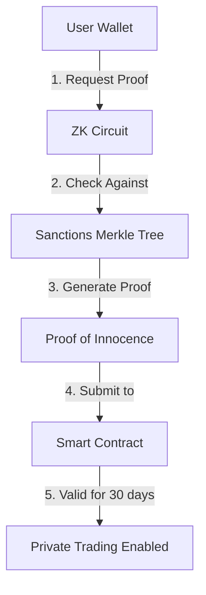

# Proof of Innocence

## What is Proof of Innocence?

Proof of Innocence is hx.finance's compliance mechanism that allows users to trade privately while ensuring they are not on any sanctions lists. It's a zero-knowledge proof that demonstrates you are **NOT** in a sanctions database without revealing your actual identity.

import { Callout } from 'nextra/components'

<Callout type="warning">
  **Testnet Only**: Private trading is currently available only on testnet. Visit [testnet.hx.finance](https://testnet.hx.finance) to try out these features before they launch on mainnet.
</Callout>

<Callout type="info">
  Think of it as a privacy-preserving background check that proves you're compliant without exposing who you are.
</Callout>

## Why is it Required?

Traditional privacy solutions often conflict with regulatory requirements. Proof of Innocence solves this by:

1. **Maintaining Compliance**: Ensures sanctioned entities cannot use the private trading system
2. **Preserving Privacy**: Doesn't reveal your identity, only that you're not sanctioned
3. **Enabling Innovation**: Allows us to offer privacy features in a regulated environment

## How Does It Work?

### The Technical Process

### Key Components

1. **Sanctions Database**: Maintained off-chain with only the Merkle root stored on-chain
2. **Zero-Knowledge Circuit**: Proves non-membership without revealing the address
3. **Smart Contract Verification**: Validates the proof and timestamps it
4. **30-Day Validity**: Proofs expire after 30 days to ensure up-to-date compliance

## Generating Your Proof

### Prerequisites

Before generating a proof, ensure:
- Your wallet is connected to hx.finance
- You have a small amount of HYPE for gas fees
- You're not using a VPN that might interfere with the process

### Step-by-Step Guide

1. **Navigate to Private Trading**
   - Click on the "Private Trading" section in the hx.finance interface
   - Select "Generate Proof of Innocence"

2. **Initiate Proof Generation**
   - Click "Generate Proof"
   - The system will create a zero-knowledge proof for your address

3. **Submit On-Chain**
   - Approve the transaction to submit your proof
   - Wait for blockchain confirmation

4. **Verification Complete**
   - You'll see a green checkmark indicating your proof is valid
   - The expiration date will be displayed (30 days from generation)

<Callout type="success">
  Once your Proof of Innocence is verified, you can immediately start using all private trading features!
</Callout>

## Proof Details

### What's Included in the Proof

The proof contains:
- **Timestamp**: When the proof was generated
- **Validity Status**: Confirmation you're not sanctioned
- **Merkle Root**: The sanctions list version used
- **Zero-Knowledge Proof**: Mathematical proof of non-membership

### What's NOT Included

The proof does NOT contain:
- Your wallet address
- Your identity
- Your location
- Any personal information

## Renewal Process

<Callout type="warning">
  Your Proof of Innocence expires after 30 days. Set a reminder to renew it before expiration to avoid interruption in private trading.
</Callout>

### When to Renew

- **Automatic Reminder**: The UI will show a warning 5 days before expiration
- **Grace Period**: You can still withdraw funds after expiration but cannot make new deposits
- **Quick Process**: Renewal takes the same steps as initial generation

### How to Renew

1. Visit the Private Trading dashboard
2. Click "Renew Proof of Innocence"
3. Follow the same generation process
4. Your new proof will be valid for another 30 days

## Privacy Guarantees

### What We Can See
- That a valid proof was submitted
- The timestamp of submission
- The proof's expiration date

### What We Cannot See
- Who submitted the proof
- Which address was proven
- Any link between proofs and trades

## Troubleshooting

### Common Issues

**"Proof Generation Failed"**
- Ensure your wallet is properly connected
- Check you have sufficient HYPE for gas
- Try refreshing the page and reconnecting

**"Proof Expired"**
- Generate a new proof following the renewal process
- You can still withdraw existing funds

**"Invalid Proof"**
- This may indicate a sanctions match
- Contact support if you believe this is an error

## FAQ

**Q: Why 30 days validity?**
A: Sanctions lists are updated regularly. The 30-day period ensures compliance with current lists while minimizing user friction.

**Q: Can I generate multiple proofs?**
A: Yes, but only the most recent proof is valid for a given address.

**Q: Is my privacy really protected?**
A: Yes! The zero-knowledge proof mathematically guarantees that no information about your address is revealed.

**Q: What if I'm incorrectly on a sanctions list?**
A: This is extremely rare, but if it occurs, you'll need to resolve it with the relevant authorities. hx.finance cannot override sanctions listings.