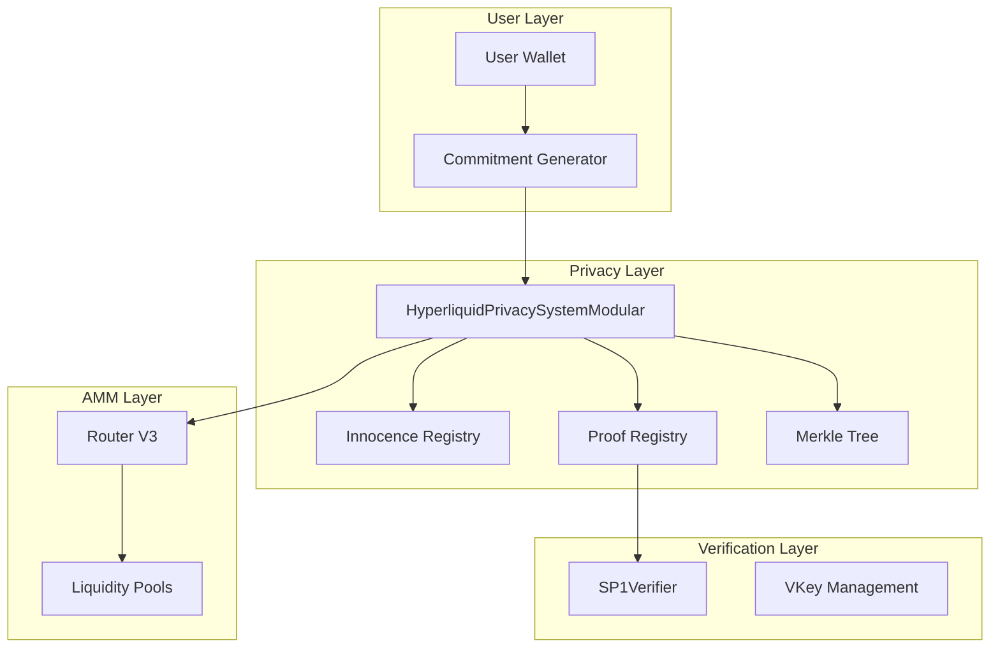

# Technical Details

This section provides in-depth technical information about the Hyperliquid Privacy System "Innocence" implementation for developers and advanced users.

import { Callout, Tabs } from 'nextra/components'

## Architecture Overview

### Modular Privacy System Architecture

The hx.finance privacy system uses a modular three-layer architecture that enables seamless upgrades without disrupting users:



### Understanding the Components

#### ZK Circuits vs Verifiers vs Verification Keys

1. **ZK Circuits** (`zk-circuits/innocence-circuits/`)
   - Generate proofs (innocence, balance, trade)
   - Written in Rust using SP1 framework
   - When updated, produce new verification keys

2. **SP1Verifier Contract**
   - The actual on-chain verifier that checks proofs
   - Uses verification keys (vkeys) to validate proofs
   - One verifier can handle multiple proof types

3. **Verification Keys (VKeys)**
   - Generated by circuits when compiled
   - Used by SP1Verifier to verify proofs
   - Different for each circuit version

## Smart Contract Architecture

### The Problem Solved by Modular Design

When you update a circuit:
- It generates a new vkey
- The contract needs this new vkey
- But hardcoding vkeys means redeploying everything
- Users lose their innocence status and deposits

### The Solution: Three-Layer Architecture

```
┌─────────────────────────────────────────────────────────┐
│            HyperliquidPrivacySystemModular               │
│         (Main contract - uses external registries)        │
└─────────────────────┬───────────────┬───────────────────┘
                      │               │
                      ▼               ▼
        ┌──────────────────┐  ┌──────────────────┐
        │ Innocence Registry│  │  Proof Registry   │
        │  (Stores proofs)  │  │ (Manages vkeys)   │
        └──────────────────┘  └──────────────────┘
                                      │
                                      ▼
                              ┌──────────────────┐
                              │   SP1Verifier     │
                              │ (Verifies proofs) │
                              └──────────────────┘
```

### Key Contracts

#### ProofRegistry.sol
- Stores verification keys for each proof type
- Supports multiple versions simultaneously
- Tracks which circuit version generated each vkey

#### InnocenceRegistry.sol
- Permanently stores user innocence status
- Survives all upgrades
- Single source of truth for compliance

#### HyperliquidPrivacySystemModular.sol
- Uses registries instead of hardcoded values
- Accepts vkey version in proof functions
- Maintains all privacy functionality

## How Circuit Updates Work

### Before (Monolithic):
```solidity
// Hardcoded in contract
bytes32 constant INNOCENCE_VKEY = 0x00182a...;

// If circuit changes, must redeploy entire contract
```

### After (Modular):
```bash
# 1. Update circuit
cd zk-circuits/innocence-circuits
cargo run --bin prove

# 2. Register new vkey (no redeploy!)
proofRegistry.registerVKey(
    ProofType.INNOCENCE,
    newVKey,
    "innocence-v2"
);

# 3. Users can use either version
proveInnocence(proof, publicValues, 0);     // Use latest
proveInnocence(proof, publicValues, 1);     // Use v1
```

## User Experience

### For Existing Users:
- Innocence status preserved in registry
- Can continue using old proof versions
- No need to re-prove or re-deposit
- Seamless experience

### For New Users:
- Automatically use latest vkey version
- Same process as before
- Better security with updated circuits

## Implementation Flow

### 1. Initial Deployment
```javascript
// Deploy all contracts
1. Deploy SP1Verifier (unchanged)
2. Deploy InnocenceRegistry
3. Deploy ProofRegistry
4. Deploy HyperliquidPrivacySystemModular
5. Register initial vkeys in ProofRegistry
```

### 2. Circuit Update Process
```javascript
// When circuit needs update
1. Update circuit code
2. Generate new proof and vkey
3. Register new vkey version:
   await proofRegistry.registerVKey(INNOCENCE, newVKey, "v2");
4. Old proofs still work!
```

### 3. Emergency Response
```javascript
// If a vkey is compromised
await proofRegistry.deactivateVKey(INNOCENCE, compromisedVersion);
// Only affects that version, system continues working
```

## Benefits of Modular Architecture

- **No Disruption**: Users never lose access or need to re-prove
- **Flexible Updates**: Update circuits without touching main contract
- **Version Support**: Multiple proof versions work simultaneously
- **Emergency Control**: Can disable specific versions if needed
- **Audit Trail**: Track all vkey versions and their sources

## Gas Considerations

- Additional external call adds ~2000 gas
- Still far cheaper than redeploying everything
- Users save gas by not re-proving innocence

## Security Notes

- Only owner can register new vkeys
- Old versions can be deprecated gradually
- Emergency pause still available
- All registries have access control

### Key Functions

<Tabs items={['Core Functions', 'View Functions', 'Events']}>
  <Tabs.Tab>
```solidity
// Prove you're not sanctioned (with optional vkey version)
function proveInnocence(
    bytes calldata innocenceProof, 
    bytes calldata publicValues,
    uint8 vkeyVersion // 0 = latest, 1+ = specific version
) external

// Make a private deposit
function deposit(
    uint64 token, 
    uint256 amount, 
    bytes32 commitment
) external

// Execute private swap (with vkey version)
function privateSwap(
    bytes calldata proof, 
    bytes calldata publicValues, 
    uint24 fee, // or bytes calldata path
    uint8 vkeyVersion
) external

// Withdraw funds (with vkey version)
function withdraw(
    bytes32 nullifier,
    address recipient,
    uint64 token,
    uint256 amount,
    bytes calldata balanceProof,
    bytes calldata publicValues,
    uint8 vkeyVersion
) external
```
  </Tabs.Tab>
  
  <Tabs.Tab>
```solidity
// Check if address has proven innocence (via registry)
function hasProvenInnocence(address user) external view returns (bool)

// Get innocence proof timestamp (via registry)
function innocenceProofTimestamp(address user) external view returns (uint256)

// Check if commitment exists
function commitmentIndices(bytes32 commitment) external view returns (uint256)

// Get current Merkle root
function getLastRoot() external view returns (bytes32)

// Get current vkey version for a proof type
function getCurrentVKeyVersion(ProofType proofType) external view returns (uint8)

// Check if a vkey version is active
function isVKeyActive(ProofType proofType, uint8 version) external view returns (bool)
```
  </Tabs.Tab>
  
  <Tabs.Tab>
```solidity
event ProofOfInnocence(
    address indexed prover, 
    uint256 timestamp
);

event Deposit(
    bytes32 indexed commitment, 
    uint64 token, 
    uint256 amount
);

event PrivateSwap(
    bytes32 indexed nullifierHash, 
    uint64 tokenIn, 
    uint64 tokenOut, 
    uint256 amountIn
);

event Withdrawal(
    bytes32 indexed nullifier, 
    address recipient, 
    uint64 token, 
    uint256 amount
);
```
  </Tabs.Tab>
</Tabs>

## Zero-Knowledge Circuits

### SP1-Based Implementation

All privacy proofs are generated using SP1 (Succinct Processor 1) zero-knowledge circuits.

### Proof Formats

#### Innocence Proof (61 bytes)
```
[0:20]   - Depositor address
[20:52]  - Sanctions Merkle root
[52:60]  - Timestamp (uint64)
[60:61]  - Is innocent flag (bool)
```

#### Balance Proof (104 bytes)
```
[0:32]   - Commitment
[32:64]  - Merkle root
[64:96]  - Minimum balance
[96:104] - Asset ID (uint64)
```

#### Trade Proof (168 bytes)
```
[0:32]    - Commitment
[32:64]   - Nullifier hash
[64:96]   - Merkle root
[96:104]  - Token in ID
[104:112] - Token out ID
[112:119] - Amount in (uint56, divided by 256)
[119:127] - Min amount out (uint64)
[127:135] - Nonce (uint64)
[135:168] - Padding (33 bytes)
```

<Callout type="info">
  Amount precision: Input amounts are stored as uint56 divided by 256 to save space while maintaining reasonable precision.
</Callout>

## Commitment System

### Commitment Generation

```javascript
commitment = hash(secret || nullifier)
```

Where:
- `secret`: 32-byte random value
- `nullifier`: 32-byte random value
- `hash`: Poseidon hash function

### Nullifier Management

Nullifiers prevent double-spending:
- Each commitment has one nullifier
- For swaps: `nullifierHash = hash(nullifier || nonce)`
- For withdrawals: Direct nullifier usage
- Stored in mapping to prevent reuse

## Token Management

### Supported Tokens

| Token | ID | Address | Decimals |
|-------|-----|---------|----------|
| WHYPE | 0 | 0x5555...5555 | 18 |
| UBTC | 1 | 0x9FDB...3463 | 8 |
| UETH | 2 | 0xBe67...7907 | 18 |
| USDE | 3 | 0x5d3a...ef34 | 18 |

### Balance Accounting

- Virtual balances tracked per commitment
- No actual token pooling (tokens remain in contract)
- Balance proofs ensure sufficient funds
- Atomic swaps maintain consistency

## Router Integration

### Uniswap V3 Integration

**Router Address**: `0xEBd14cdF290185Cc4d0b5eC73A0e095d780e5D2f`

#### Single-Hop Swaps
```solidity
ISwapRouter.ExactInputSingleParams({
    tokenIn: tokenInAddress,
    tokenOut: tokenOutAddress,
    fee: fee,
    recipient: address(this),
    deadline: block.timestamp,
    amountIn: amountIn,
    amountOutMinimum: minAmountOut,
    sqrtPriceLimitX96: 0
})
```

#### Multi-Hop Swaps
- Path encoded as: `token0 || fee0 || token1 || fee1 || token2...`
- Automatic routing through multiple pools
- Best execution path calculation

## Security Features

### Reentrancy Protection
- OpenZeppelin's ReentrancyGuard
- Check-effects-interactions pattern
- State updates before external calls

### Commitment Uniqueness
- Each commitment must be unique
- Tracked in `commitmentIndices` mapping
- Prevents duplicate deposits

### Nonce Enforcement
- Sequential nonces per commitment
- Prevents replay attacks
- Ensures transaction ordering

### Approval Management
```solidity
// Reset approval before setting new
IERC20(token).approve(spender, 0);
IERC20(token).approve(spender, amount);
```

## Merkle Tree System

### Commitment Tree
- Incremental Merkle tree
- Height: 20 (supports ~1M commitments)
- Hash function: Poseidon
- Efficient updates with frontier tracking

### Sanctions Tree
- Static Merkle tree
- Updated via off-chain oracle
- Only root stored on-chain
- Python updater script included

## Gas Optimization

### Packed Formats
- Proof data tightly packed
- Minimal calldata usage
- Efficient storage patterns

### Batch Capabilities
- Multiple operations per transaction (planned)
- Shared proof verification
- Reduced overhead

## Integration Guide

### For Developers

<Tabs items={['JavaScript', 'Python', 'Solidity']}>
  <Tabs.Tab>
```javascript
// Example: Making a private deposit
const { ethers } = require('ethers');
const crypto = require('crypto');

function generateCommitment() {
    // Generate random 32-byte values
    const secret = '0x' + crypto.randomBytes(32).toString('hex');
    const nullifier = '0x' + crypto.randomBytes(32).toString('hex');
    
    // In production, use Poseidon hash
    // For this example, using keccak256
    const commitment = ethers.utils.keccak256(
        ethers.utils.solidityPack(['bytes32', 'bytes32'], [secret, nullifier])
    );
    
    return { commitment, secret, nullifier };
}

async function privateDeposit(amount, tokenId) {
    // Generate commitment
    const { commitment, secret, nullifier } = generateCommitment();
    
    // Save secret and nullifier securely!
    // Store these values encrypted - they're needed for withdrawals
    await saveCommitmentData(secret, nullifier);
    
    // Execute deposit
    const tx = await privacyContract.deposit(
        tokenId,
        amount,
        commitment
    );
    
    return tx.hash;
}
```
  </Tabs.Tab>
  
  <Tabs.Tab>
```python
# Example: Generating commitment data
import hashlib
import secrets
from web3 import Web3

def generate_commitment():
    # Generate random 32-byte values
    secret = '0x' + secrets.token_hex(32)
    nullifier = '0x' + secrets.token_hex(32)
    
    # In production, use Poseidon hash
    # For this example, using keccak256
    data = secret[2:] + nullifier[2:]  # Remove 0x prefixes
    commitment = Web3.keccak(hexstr=data)
    
    return {
        'commitment': commitment.hex(),
        'secret': secret,
        'nullifier': nullifier
    }

def prepare_deposit(amount, token_id):
    # Generate commitment
    commitment_data = generate_commitment()
    
    # Store these values securely - needed for future operations
    # Never share or lose these values!
    
    return {
        'token_id': token_id,
        'amount': amount,
        'commitment': commitment_data['commitment'],
        'secret': commitment_data['secret'],
        'nullifier': commitment_data['nullifier']
    }
```
  </Tabs.Tab>
  
  <Tabs.Tab>
```solidity
// Example: Integrating with privacy system
interface IPrivacySystem {
    function deposit(uint64 token, uint256 amount, bytes32 commitment) external;
    function hasProvenInnocence(address user) external view returns (bool);
}

contract MyContract {
    IPrivacySystem privacy = IPrivacySystem(PRIVACY_ADDRESS);
    
    function privateAction() external {
        require(privacy.hasProvenInnocence(msg.sender), "Prove innocence first");
        // Your logic here
    }
}
```
  </Tabs.Tab>
</Tabs>

## Deployment Information

### Mainnet Deployment
- Network: Hyperliquid Mainnet
- Chain ID: 998
- Contract: `[Deployed Address]`
- Verifier: `[Verifier Address]`

### Configuration
- Innocence validity: 30 days
- Min deposit: 0.001 tokens
- Max commitments: ~1 million
- Supported tokens: 4 (expandable)

## Future Enhancements

### Planned Features
- Private liquidity provision
- Cross-chain privacy bridges
- Batch operations
- Hardware wallet integration
- Governance participation

### Research Areas
- Optimistic rollup integration
- Account abstraction support
- Social recovery mechanisms
- Decentralized sequencer

<Callout type="success">
  For the latest updates and detailed implementation code, visit our [GitHub repository](https://github.com/hxfinance/privacy-contracts).
</Callout>